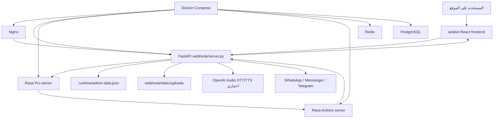

# تقرير مشروع AzaBot / Alazab Rasa

تقرير بلدي واضح للمهندس المسؤول عن التنفيذ والتشغيل.

تاريخ التقرير: 2026-04-23

## 1. ملخص الكلام كله

المشروع عبارة عن بوت محادثة لمجموعة الأعزب. فيه أكثر من طبقة:

- واجهة أمامية React اسمها `azabot`.
- خادم FastAPI في `webhook/server.py`.
- Rasa Pro مسؤول عن فهم الرسائل والردود.
- Actions Server في مجلد `actions`.
- Redis وPostgreSQL للتشغيل الإنتاجي.
- لوحة إدارة داخل الواجهة.
- مسار إضافي قديم/موازي على Supabase Functions.
- ملفات نشر Docker وNginx وسكربتات تشغيل بدون Docker.

المطلوب الحالي من صاحب المشروع:

اعتماد مجلد `azabot` كواجهة أساسية بدل الواجهة القديمة `azabot-prod` التي تم حذفها.

الخلاصة التنفيذية:

الواجهة `azabot` صالحة كبداية وتبني Production Build بنجاح، لكن المشروع كان فيه لخبطة بين مسارين:

1. مسار أساسي جديد:
   Browser -> FastAPI `/chat` -> Rasa -> Actions

2. مسار قديم/موازي:
   Embed script -> Supabase `chat-v2`

لازم المهندس يثبت قرار معماري واحد:

- إما نخلي كل شيء على FastAPI/Rasa.
- أو نخلي الـ embed فقط على Supabase، مع توثيق أنه مسار منفصل.

أنا أوصي إنتاجياً بالمسار الأول:

Browser / Website / Admin -> FastAPI -> Rasa -> Actions

وSupabase يبقى خارج المسار الأساسي أو يتم حذفه لاحقاً بعد نقل أي وظيفة لازمة.

## 2. الهدف من المشروع

المشروع هدفه يعمل مساعد ذكي باسم AzaBot يخدم عدة براندات:

- مجموعة الأعزب الرئيسية.
- التشطيبات الفاخرة.
- الهوية البصرية.
- UberFix للصيانة.
- ألبان العصفور.

كل براند له:

- اسم بوت مختلف.
- لون وهوية مختلفة.
- أسئلة سريعة مختلفة.
- ربط بالـ Rasa brand المناسب.
- إمكانية استقبال رسائل من الموقع وقنوات أخرى مثل WhatsApp وTelegram.

## 3. الخريطة المعمارية المقترحة



المسار الإنتاجي الذي يجب تثبيته:

```text
Browser
  -> Nginx
  -> FastAPI webhook
  -> Rasa REST API
  -> Actions Server
  -> FastAPI
  -> Browser
```

## 4. حالة مجلد azabot

مجلد `azabot` هو مشروع React/Vite مستقل.

أهم الملفات:

- `azabot/package.json`: أوامر التشغيل والبناء.
- `azabot/src/App.tsx`: الراوتر الرئيسي.
- `azabot/src/pages/SitePage.tsx`: الصفحة الموحدة لكل براند.
- `azabot/src/components/AzaBot.tsx`: نافذة الشات.
- `azabot/src/hooks/useChat.ts`: منطق إرسال الرسائل.
- `azabot/src/lib/chat-service.ts`: الاتصال بالباك إند.
- `azabot/src/config/sites.ts`: إعدادات البراندات.
- `azabot/embed/azabot-embed.js`: سكربت تضمين خارجي.
- `azabot/deploy/nginx/chat.alazab.com.conf`: Nginx خاص بمسار embed/Supabase.
- `azabot/supabase/functions`: Supabase Edge Functions.

الأوامر التي نجحت:

```powershell
pnpm install --frozen-lockfile
pnpm lint
pnpm test
pnpm build
```

النتيجة:

- الواجهة تبني `dist` بنجاح.
- lint ناجح.
- test ناجح، لكنه test بسيط جداً وغير كافٍ للإنتاج.

## 5. ما تم تعديله لاعتماد azabot كواجهة أساسية

كان الخادم `webhook/server.py` يخدم الواجهة من:

```text
azabot-prod/dist
```

لكن هذا المجلد محذوف. لذلك تم توجيهه إلى:

```text
azabot/dist
```

تم تعديل:

- `webhook/server.py`
- `Dockerfile.webhook`
- `scripts/deploy-server-nodocker.sh`
- `azabot/tsconfig.app.json`
- `azabot/.gitignore`
- `azabot/supabase/config.toml`
- `azabot/deploy/nginx/chat.alazab.com.conf`
- `azabot/embed/azabot-embed.js`

الهدف من التعديلات:

- FastAPI يخدم `azabot/dist`.
- Docker يبني `azabot` داخل image.
- سكربت النشر بدون Docker يبني `azabot`.
- منع فشل TypeScript بسبب كود Supabase غير مستخدم في واجهة React.
- تحديث project ref الخاص بـ Supabase من القديم إلى الجديد.

## 6. مشكلة البراندات وحلها

الواجهة تستخدم ids بالشكل:

```text
luxury-finishing
brand-identity
laban-alasfour
uberfix
alazab
```

لكن Rasa والباك إند يستخدمان:

```text
luxury_finishing
brand_identity
laban_alasfour
uberfix
alazab_construction
```

لو لم نعمل mapping صريح، بعض الرسائل ستصل للبراند الافتراضي أو براند غلط.

تمت إضافة mapping في `webhook/server.py`:

```text
alazab -> alazab_construction
luxury-finishing -> luxury_finishing
brand-identity -> brand_identity
laban-alasfour -> laban_alasfour
uberfix -> uberfix
```

كذلك تمت إضافة دومينات البراندات:

```text
alazab.com
www.alazab.com
bot.alazab.com
www.bot.alazab.com
luxury-finishing.alazab.com
brand-identity.alazab.com
uberfix.alazab.com
laban-alasfour.alazab.com
```

## 7. وضع Supabase الحالي

تم تنفيذ:

```powershell
supabase functions deploy
```

والنشر نجح على project:

```text
fjojyzvulhvqeitnaenv
```

الـ functions التي تم نشرها:

- `admin-api`
- `admin-login`
- `bot-public-settings`
- `chat`
- `chat-v2`
- `elevenlabs-stt`
- `elevenlabs-tts`

مهم جداً:

قائمة `supabase secrets list` تعرض أسماء الأسرار و digest فقط، وليس القيم الحقيقية.
هذا آمن نسبياً، لكن لا يجب نشر القيم الحقيقية نفسها في Git أو في الشات.

الأسرار الموجودة تغطي أغلب المطلوب، مثل:

- `SUPABASE_URL`
- `SUPABASE_SERVICE_ROLE_KEY`
- `LOVABLE_API_KEY`
- `ELEVENLABS_API_KEY`
- `GCP_PROJECT_ID`
- `DIALOGFLOW_AGENT_ID`
- `GCP_ACCESS_TOKEN`

لكن يوجد سر ناقص مهم:

```text
ADMIN_JWT_SECRET
```

هذا مستخدم في:

- `supabase/functions/admin-login/index.ts`
- `supabase/functions/admin-api/index.ts`

لازم يتضاف:

```powershell
$bytes = New-Object byte[] 48
[Security.Cryptography.RandomNumberGenerator]::Fill($bytes)
$secret = [Convert]::ToBase64String($bytes)
supabase secrets set ADMIN_JWT_SECRET="$secret"
```

## 8. أين اللخبطة المعمارية؟

اللخبطة أن عندنا مسارين شات:

### المسار الأول: FastAPI/Rasa

هذا هو المسار الذي تستخدمه واجهة React الأساسية `azabot`.

الواجهة ترسل إلى:

```text
/chat
/chat/upload
/chat/audio
/chat/tts
```

وهذه موجودة في:

```text
webhook/server.py
```

هذا المسار مناسب للمشروع الأساسي لأن Rasa هو قلب النظام.

### المسار الثاني: Supabase chat-v2

هذا موجود في:

```text
azabot/embed/azabot-embed.js
azabot/deploy/nginx/chat.alazab.com.conf
azabot/supabase/functions/chat-v2
```

هذا المسار لا يمر على Rasa بنفس الطريقة. يعتمد على Supabase Edge Function.

الخطر:

لو تركنا المسارين بدون قرار واضح، المستخدم على الموقع الرئيسي قد يأخذ ردود من Rasa، والمستخدم عبر embed قد يأخذ ردود من Supabase/Dialogflow/LLM.

هذا يخلق:

- اختلاف في الردود.
- اختلاف في السجلات.
- اختلاف في لوحة الإدارة.
- صعوبة debugging.
- صعوبة معرفة أي نظام هو الإنتاج الحقيقي.

## 9. القرار المعماري المطلوب

أوصي بالقرار التالي:

اعتماد FastAPI/Rasa كالنواة الأساسية.

يعني:

- واجهة `azabot` الأساسية تستخدم FastAPI.
- `/chat` هو endpoint الرسمي.
- لوحة الإدارة تستخدم FastAPI admin endpoints.
- رفع الملفات والصوت يتم عبر FastAPI.
- Rasa هو مصدر الحقيقة للردود.
- Supabase لا يدخل في مسار الشات الأساسي.

بعد القرار، المهندس ينفذ واحد من الخيارين:

### خيار A - حذف/تجميد Supabase من المسار الأساسي

مناسب لو المشروع قائم على Rasa.

نفذ:

1. عدّل `embed/azabot-embed.js` ليرسل إلى FastAPI `/chat` بدل Supabase `chat-v2`.
2. عدّل `deploy/nginx/chat.alazab.com.conf` ليعمل proxy إلى FastAPI بدل Supabase.
3. أوقف استخدام `supabase/functions/chat-v2` في الإنتاج.
4. احتفظ بـ Supabase فقط لو فيه admin أو storage مطلوب فعلاً.

### خيار B - إبقاء Supabase للـ embed فقط

مناسب لو تريد widget مستقل للمواقع الخارجية.

نفذ:

1. وثّق أن `embed` لا يستخدم Rasa.
2. لا تخلط إحصائياته مع إحصائيات FastAPI.
3. اعمل dashboard منفصلة أو sync واضح للبيانات.
4. اختبر `chat-v2` بشكل مستقل.

أنا أوصي بخيار A.

## 10. وضع Docker

ملف `Dockerfile.webhook` تم تعديله ليبني الواجهة:

```text
node:22.13-alpine -> pnpm build -> python image -> copy dist
```

ده معناه:

عند بناء صورة webhook، الواجهة هتتبني تلقائياً وتدخل داخل image.

ميزة هذا:

- لا نعتمد على أن `azabot/dist` موجود على جهاز المطور.
- النشر النظيف لن يفشل بسبب غياب `dist`.

لكن لم يتم اختبار Docker build لأن Docker Desktop غير شغال على الجهاز وقت الفحص.

المهندس لازم يشغل:

```powershell
docker compose --env-file .env -f docker-compose.prod.yaml config
docker compose --env-file .env -f docker-compose.prod.yaml build webhook
docker compose --env-file .env -f docker-compose.prod.yaml up -d
```

## 11. وضع التشغيل بدون Docker

يوجد سكربت:

```text
scripts/deploy-server-nodocker.sh
```

تم تعديله ليستخدم:

```text
azabot
```

بدل:

```text
azabot-prod
```

المسار بدون Docker مناسب لو السيرفر عليه:

- Python venv
- Node 22.13+
- pnpm 10.33+
- systemd
- Nginx
- PostgreSQL خارجي
- Redis خارجي

أمر النشر المتوقع:

```bash
bash scripts/deploy-server-nodocker.sh --configure-nginx --domain bot.alazab.com
```

## 12. وضع الأمن والأسرار

المشروع فيه ملفات حساسة محتملة:

- `.env` في جذر المشروع.
- `azabot/.env`.
- `azabot/supabase/.env`.
- `ssl/`.
- مفاتيح WhatsApp وTelegram وOpenAI وSupabase.

المشكلة المهمة:

داخل Git الداخلي لـ `azabot`، ملف `.env` ظاهر كملف متتبع.

لازم المهندس ينفذ:

```powershell
git -C azabot rm --cached .env
git -C azabot rm --cached supabase/.env
```

ثم يتأكد:

```powershell
git -C azabot status --short
```

لو أي سر حقيقي كان دخل GitHub، لازم تدوير السر من مصدره:

- OpenAI
- Supabase
- Meta/WhatsApp
- Telegram
- ElevenLabs
- GCP

## 13. وضع Git والمجلدات

في الريبو الرئيسي:

`azabot-prod` محذوف بالكامل.

`azabot` موجود كمجلد جديد غير متتبع في Git الرئيسي.

وفي نفس الوقت، `azabot` نفسه يحتوي `.git` داخلي.

هذا معناه أن عندنا اختيار لازم يتعمل:

### اختيار 1 - دمج azabot داخل الريبو الرئيسي

احذف `.git` الداخلي من `azabot` ثم أضف المجلد للريبو الرئيسي.

مناسب لو المشروع كله mono-repo.

### اختيار 2 - جعله Git submodule

احتفظ بـ `.git` الداخلي، وأضفه كـ submodule.

مناسب لو `azabot` له حياة مستقلة ومستودع خاص.

أنا أوصي في الحالة الحالية بالاختيار 1:

دمجه داخل الريبو الرئيسي، لأن FastAPI وDocker والنشر صاروا يعتمدون عليه مباشرة.

## 14. وضع الاختبارات

الذي نجح:

```powershell
pnpm lint
pnpm test
pnpm build
python -m py_compile webhook/server.py
```

كذلك تم اختبار:

```text
GET /
GET /brand-identity
GET /assets/...
```

وكلها رجعت 200.

لكن الاختبارات الحالية غير كافية للإنتاج.

لازم إضافة اختبارات فعلية:

1. اختبار اختيار البراند من path.
2. اختبار إرسال رسالة إلى `/chat`.
3. اختبار upload.
4. اختبار `/chat/audio` لو الصوت مطلوب.
5. اختبار `/admin/stats` عند وجود `ADMIN_API_KEY`.
6. اختبار بناء Docker image.
7. اختبار أن Nginx يخدم React ولا يكسر SPA routes.

## 15. خطة التنفيذ للمهندس

### المرحلة الأولى: تثبيت القرار

نفذ:

1. قرر أن FastAPI/Rasa هو المسار الأساسي.
2. أعلن أن `azabot-prod` انتهى.
3. اعتمد `azabot` كمجلد الواجهة الرسمي.

### المرحلة الثانية: تنظيف Git

نفذ:

1. احسم وضع `azabot`: مجلد عادي أم submodule.
2. لا تترك `.env` متتبعاً.
3. لا تضف `dist`.
4. لا تضف `node_modules`.
5. راجع `git status` قبل أي commit.

### المرحلة الثالثة: توحيد الشات

نفذ:

1. واجهة React ترسل إلى `/chat`.
2. embed script يرسل إلى `/chat` أو يتم توثيقه كمسار مستقل.
3. Nginx يوجه كل API الرسمي إلى FastAPI.
4. Supabase `chat-v2` لا يكون مساراً خفياً للمستخدم النهائي بدون توثيق.

### المرحلة الرابعة: تشغيل Production Build

نفذ:

```powershell
cd A:\a\chatbot\alazab-rasa\azabot
pnpm install --frozen-lockfile
pnpm lint
pnpm test
pnpm build
```

ثم من جذر المشروع:

```powershell
cd A:\a\chatbot\alazab-rasa
.\.venv\Scripts\python.exe -m py_compile webhook\server.py
```

### المرحلة الخامسة: تشغيل محلي كامل

لو بدون Docker:

1. شغل Rasa.
2. شغل Actions.
3. شغل FastAPI.
4. افتح `http://127.0.0.1:8000`.
5. ابعت رسالة من الواجهة.
6. راقب اللوجات.

لو Docker:

```powershell
docker compose --env-file .env -f docker-compose.prod.yaml config
docker compose --env-file .env -f docker-compose.prod.yaml up -d --build
docker compose --env-file .env -f docker-compose.prod.yaml logs -f webhook
```

### المرحلة السادسة: اختبار Supabase لو سيبناه

نفذ:

```powershell
cd A:\a\chatbot\alazab-rasa\azabot
supabase secrets list
supabase functions deploy
```

ثم أضف السر الناقص:

```powershell
$bytes = New-Object byte[] 48
[Security.Cryptography.RandomNumberGenerator]::Fill($bytes)
$secret = [Convert]::ToBase64String($bytes)
supabase secrets set ADMIN_JWT_SECRET="$secret"
```

ثم اختبر endpoints الخاصة بالـ functions من Dashboard أو curl.

## 16. قائمة مخاطر مهمة

### خطر 1: مسارين للردود

لو FastAPI وSupabase شغالين معاً بدون قرار، الردود هتختلف.

الحل:

توحيد المسار أو توثيق الفصل.

### خطر 2: أسرار في Git

لو `.env` متتبع في `azabot`، ده خطر عالي.

الحل:

إزالة التتبع وتدوير الأسرار إذا لزم.

### خطر 3: `azabot` Git داخلي

لو الريبو الرئيسي لا يعرف `azabot` صح، النشر على سيرفر جديد قد يفشل.

الحل:

دمجه أو عمل submodule رسمي.

### خطر 4: اختبارات ضعيفة

test الحالي لا يثبت أن البوت يعمل.

الحل:

إضافة smoke tests حقيقية.

### خطر 5: Docker غير مختبر

تم تعديل Dockerfile لكن Docker لم يكن شغالاً وقت الفحص.

الحل:

اختبار build على جهاز أو CI فيه Docker.

### خطر 6: لوحة الإدارة لها مسارين

في FastAPI يوجد admin endpoints، وفي Supabase يوجد admin functions.

الحل:

اختيار لوحة إدارة واحدة أو فصل واضح بينهما.

## 17. أوامر فحص سريعة بعد أي تعديل

من داخل `azabot`:

```powershell
pnpm install --frozen-lockfile
pnpm lint
pnpm test
pnpm build
```

من جذر المشروع:

```powershell
.\.venv\Scripts\python.exe -m py_compile webhook\server.py
```

اختبار خدمة الواجهة من FastAPI:

```powershell
.\.venv\Scripts\python.exe -m uvicorn webhook.server:app --host 127.0.0.1 --port 8000
```

افتح:

```text
http://127.0.0.1:8000/
http://127.0.0.1:8000/brand-identity
http://127.0.0.1:8000/luxury-finishing
http://127.0.0.1:8000/uberfix
http://127.0.0.1:8000/laban-alasfour
```

## 18. تعريف "تم التنفيذ بنجاح"

نعتبر المشروع جاهز إنتاجياً لما يحصل التالي:

1. `azabot` داخل Git الرئيسي أو submodule رسمي.
2. لا يوجد اعتماد على `azabot-prod`.
3. `pnpm build` ناجح.
4. FastAPI يخدم `/` وroutes الخاصة بالبراندات.
5. `/chat` يرد من Rasa بنجاح.
6. رفع الملفات يعمل.
7. الصوت يعمل أو يتم إخفاؤه لو مفاتيح OpenAI غير مضبوطة.
8. admin dashboard تعمل بمسار واحد واضح.
9. Docker build ناجح.
10. Nginx production config مختبر.
11. الأسرار خارج Git.
12. يوجد runbook واضح للتشغيل والإيقاف والمراقبة.

## 19. ملخص للمدير أو صاحب القرار

المشروع ليس مجرد واجهة. هو نظام كامل فيه:

- React frontend.
- FastAPI gateway.
- Rasa bot engine.
- Actions.
- قنوات خارجية.
- إدارة.
- نشر.
- أسرار.

الواجهة الجديدة `azabot` جاهزة كبناء، وتم ربطها بالخادم الأساسي. المشكلة الأساسية المتبقية ليست في React، بل في القرار المعماري:

هل Supabase جزء من النظام الأساسي أم بقايا من نسخة سابقة؟

القرار الأفضل:

خلي FastAPI/Rasa هو الأصل، ونظف Supabase من مسار الشات الأساسي.

بعدها المشروع يبقى أسهل في التشغيل، أسهل في المراقبة، وأسهل في التطوير.

## 20. المطلوب تنفيذه الآن بالترتيب

1. إضافة `ADMIN_JWT_SECRET` في Supabase إذا ستستخدم Admin Supabase.
2. إزالة `.env` من Git الداخلي لـ `azabot`.
3. حسم وضع `azabot`: مجلد داخل الريبو أو submodule.
4. تعديل `embed/azabot-embed.js` ليستخدم FastAPI إن كان مطلوباً توحيد المسار.
5. اختبار Docker build.
6. تشغيل smoke test كامل:
   - افتح الواجهة.
   - اختر كل براند.
   - أرسل رسالة.
   - ارفع ملف.
   - جرب لوحة الإدارة.
   - راقب logs.
7. بعد نجاح الاختبارات، اعمل commit واضح باسم:

```text
Adopt azabot as production frontend
```

